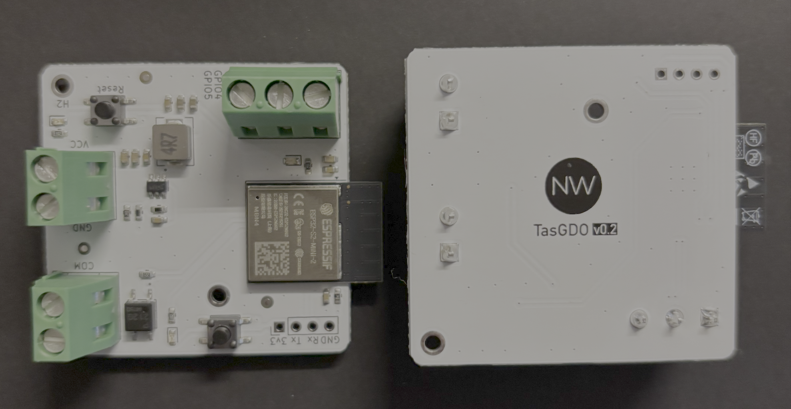

# TasGDO

[](https://github.com/nrwiersma/tasgdo/releases)
[](https://raw.githubusercontent.com/nrwiersma/tasgdo/main/LICENSE)

`TasGDO` is an ESP32 Garage Door Controller, intended to be used with [Tasmota](https://tasmota.github.io/docs/) for a local
Matter controller.



## GPIO Pins

* **0**: Button to operate the Solid State Relay/Enter flash mode
* **2**: Link LED
* **4**: Reed/limit switch sensor (User configurable)
* **5**: Reed/limit switch sensor (User configurable)
* **17**: Solid State Relay 
* **18**: Relay LED

## Setup

Once Tasmota has been installed, the following template can be set:

```json
{"NAME":"TasGDO","GPIO":[32,0,544,0,1,1,0,0,0,0,0,0,0,0,0,0,0,224,320,0,0,0,0,0,0,0,0,0,0,0,0,0,0,0,0,0],"FLAG":0,"BASE":1}
```

Then run the following Commands in the Console:

```
PulseTime1 10
```

sets the relay to turn off after 1s.

```
SetOption1 1
SetOption13 1
```

sets the button to respond immediately

```
SwitchMode2 15
SwitchMode3 15
```

detaches `Switch2` and `Switch3` from the relays, which are not set. To be used
with GPIO4 and GPIO5.
 