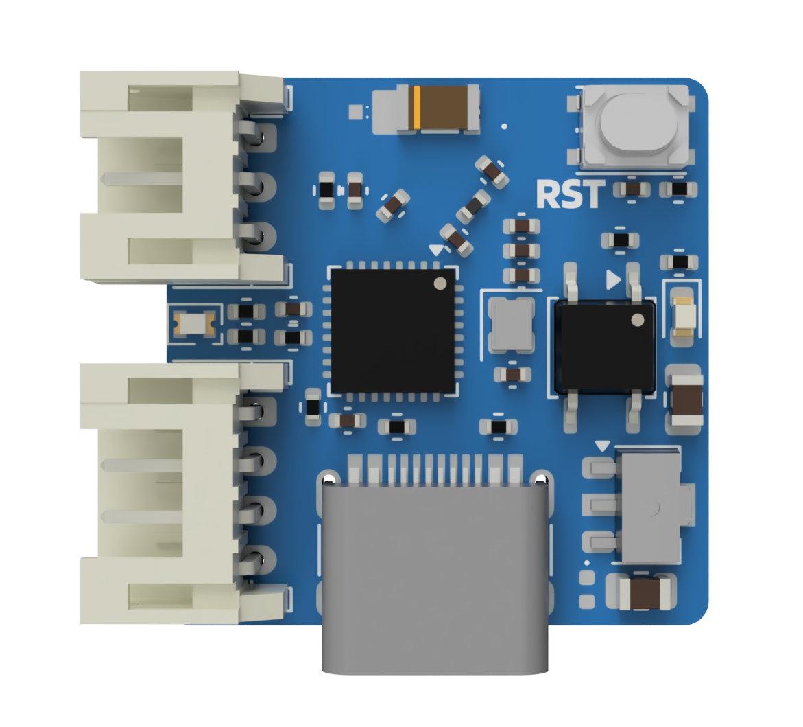
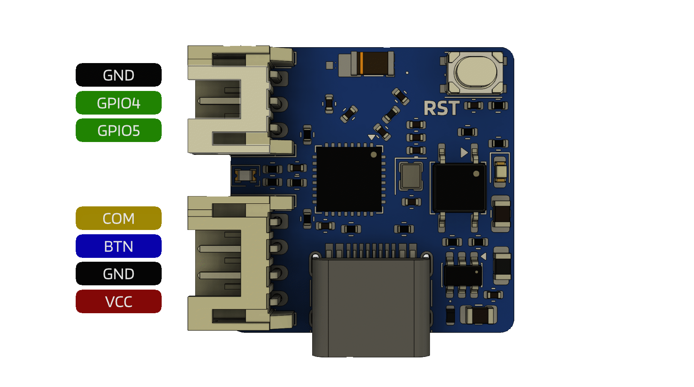

<picture>
  <source media="(prefers-color-scheme: dark)" srcset="http://svg.wiersma.co.za/github/project.v2?title=tasgdo&tag=garage%20door%20controller&mode=dark">
  <source media="(prefers-color-scheme: light)" srcset="http://svg.wiersma.co.za/github/project.v2?title=tasgdo&tag=garage%20door%20controller">
  
</picture>

[](https://github.com/nrwiersma/tasgdo/releases)
[](https://raw.githubusercontent.com/nrwiersma/tasgdo/main/LICENSE)

`TasGDO` is an ESP32 Garage Door Controller, intended to be used with [Tasmota](https://tasmota.github.io/docs/) for a local
Matter controller.



## Pinout



## GPIO Pins

| Pin | Function                                                  |
|-----|-----------------------------------------------------------|
| 0   | Solid State Relay                                         | 
| 3   | Link LED                                                  |
| 4   | Reed/limit switch sensor (User configurable)              |
| 5   | Reed/limit switch sensor (User configurable)              |
| 6   | Relay LED                                                 |
| 9   | Button to operate the Solid State Relay/Enter flash mode  |

## Setup

Once Tasmota has been installed, the following template can be set:

```json
{"NAME":"TasGDO","GPIO":[224,0,0,544,1,1,288,0,0,32,0,0,0,0,0,0,0,0,0,0,0,0],"FLAG":0,"BASE":1}
```

Then run the following Commands in the Console:

```
PulseTime1 10
```

sets the relay to turn off after 1s.

```
SetOption1 1
SetOption13 1
```

sets the button to respond immediately

```
SwitchMode2 15
SwitchMode3 15
```

detaches `Switch2` and `Switch3` from the relays, which are not set. To be used
with GPIO4 and GPIO5.

## BOM

See the [Interactive BOM](https://htmlpreview.github.io/?https://github.com/nrwiersma/tasgdo/blob/main/bom/ibom.html) [(provided by InteractiveHtmlBom)
](https://github.com/openscopeproject/InteractiveHtmlBom).
 